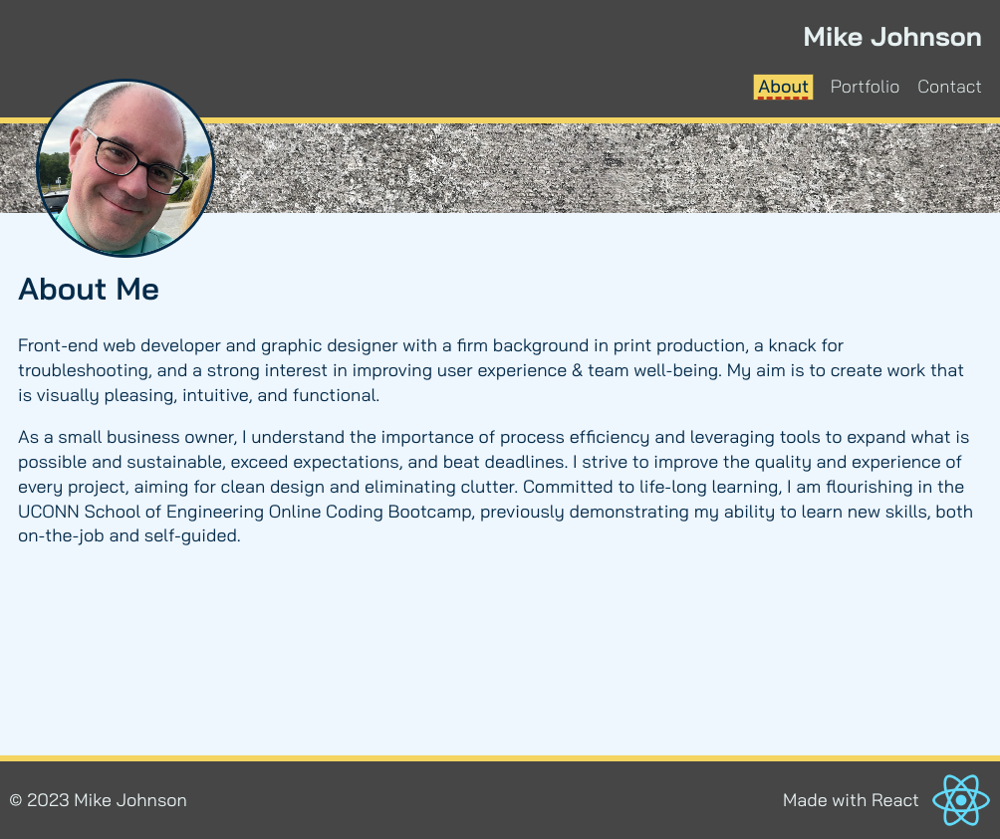

# react-portfolio

  

  ## Description
  
  This project is a personal portfolio page built using React.js. This portfolio is primarily a refactored project, earlier built with plain HTML and CSS as a single HTML document.  The updated project is a React application incorporating React Router Dom for page routes. My goal was to sufficiently replicate my existing portfolio page to a working app. Once this is completed (contact form is not functional on the back end) I plan on incorporating CSS Grid for layout. Content will be updated as my skills grow!
  
  ## Author
  
  The author for this project is [Mike Johnson](https://github.com/MikeWebPrint)
  
  ## Table of Contents
  
  - [Installation](#installation)
  - [License](#license)
  
  ## Installation
  
  This portfolio application requires no installation, but is deployed as a website at https://mikewebprint.github.io/react-portfolio/.

  
  
  ## License
  
  MIT
  
  ## Features
  
  This project features page routes, style transitions, conditional formatting.
  
  ## Repository
  
  Code for this project can be reviewed here: [https://github.com/MikeWebPrint/react-portfolio](https://github.com/MikeWebPrint/react-portfolio)
  
  
  

